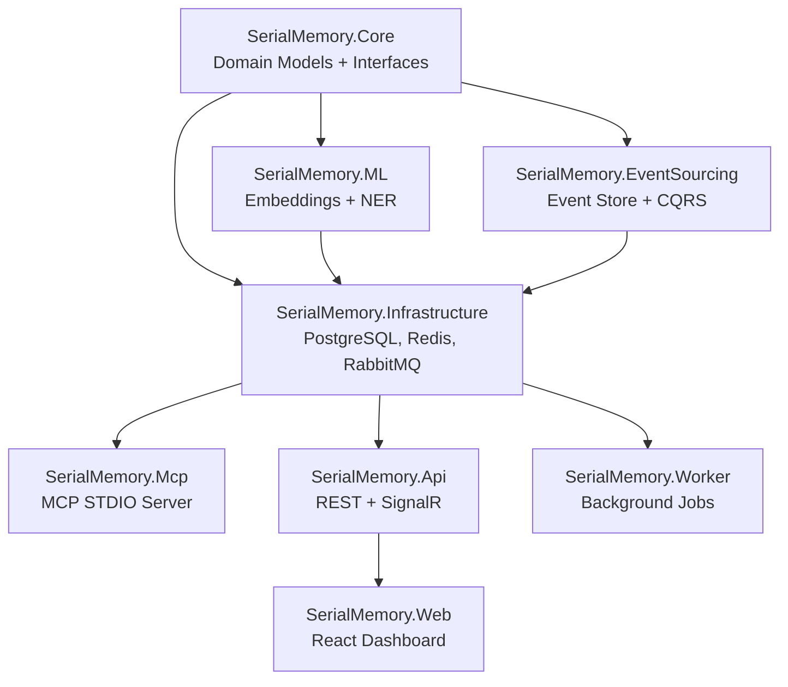

# SerialMemoryServer — Codebase Graph

A temporal knowledge graph memory system providing semantic search, entity extraction, event sourcing, and MCP protocol integration for AI agents.

## Major Modules (~114k lines)

| # | Module | Lines | Purpose |
|---|--------|-------|---------|
| 1 | **SerialMemory.Core** | ~19k | Domain models, service interfaces, orchestration |
| 2 | **SerialMemory.Infrastructure** | ~42k | PostgreSQL/pgvector, auth, RLS, external integrations |
| 3 | **SerialMemory.Mcp** | ~7.5k | MCP STDIO server — Claude/AI agent integration |
| 4 | **SerialMemory.Api** | ~19k | REST API, SignalR, dashboard endpoints |
| 5 | **SerialMemory.EventSourcing** | ~6.7k | Append-only event store, CQRS, autonomous maintenance |
| 6 | **SerialMemory.ML** | ~2.1k | Embeddings (Ollama/ONNX/OpenAI), NER, LLM services |
| 7 | **SerialMemory.Web** | ~7.4k | React dashboard — 3D graph, search, admin UI |

## Architecture

## Key Patterns

- **Clean Architecture**: Core (domain) → Infrastructure → Presentation
- **Event Sourcing**: 13 event types, append-only, optimistic concurrency
- **CQRS**: Separate command handlers (writes) and query handlers (reads)
- **Multi-tenancy**: Workspace scoping via PostgreSQL Row-Level Security
- **MCP Protocol**: STDIO JSON-RPC for AI agent integration
- **Autonomous Maintenance**: Background workers for decay, dedup, contradiction detection

## Tech Stack

| Layer | Tech |
|-------|------|
| Runtime | .NET 10, C# 12 |
| Database | PostgreSQL 15 + pgvector |
| Queue | RabbitMQ + MassTransit |
| Cache | Redis |
| Embeddings | Ollama / ONNX / OpenAI |
| Frontend | React 19, Vite, Three.js |
| Observability | OpenTelemetry, Prometheus |

## Child Nodes

- [01-core.md](./01-core.md)
- [02-infrastructure.md](./02-infrastructure.md)
- [03-mcp.md](./03-mcp.md)
- [04-api.md](./04-api.md)
- [05-event-sourcing.md](./05-event-sourcing.md)
- [06-ml.md](./06-ml.md)
- [07-web.md](./07-web.md)
