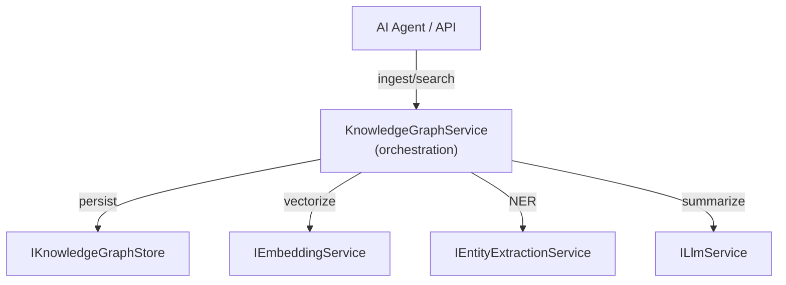

# SerialMemory.Core — Domain Layer

Parent: [00-root.md](./00-root.md)

## Purpose

Domain models, service interfaces, and orchestration logic for the temporal knowledge graph. Zero infrastructure dependencies — pure Clean Architecture domain layer. Contains the `KnowledgeGraphService` orchestrator and ~580-line `GraphSchema` defining all valid entity/relationship types.

## Core Flow

## Sub-Components

### 1. Models
**Files**: `Models/Memory.cs`, `Entity.cs`, `EntityRelationship.cs`, `ConversationSession.cs`, `UserPersona.cs`, `Workspace.cs`, `WorkspaceSnapshot.cs`, `CallContext.cs`
**Purpose**: Core domain entities — memories with embeddings, entities, relationships, sessions, workspaces
**Key types**: `Memory`, `Entity`, `EntityRelationship`, `UserPersona`, `Workspace`, `WorkspaceStateData`

### 2. Interfaces
**Files**: `Interfaces/IKnowledgeGraphStore.cs`, `IEmbeddingService.cs`, `IEntityExtractionService.cs`, `ILlmService.cs`, `IEventWriter.cs`, `ILiveEventEmitter.cs`, `IClassificationService.cs`
**Purpose**: Contracts for all infrastructure services — data access, ML, events, classification
**Key interfaces**: `IKnowledgeGraphStore` (main data contract), `IEmbeddingService`, `IHybridRetrievalEngine`

### 3. KnowledgeGraphService
**Files**: `Services/KnowledgeGraphService.cs`
**Purpose**: Central orchestration layer — coordinates store, embedding, extraction, and event services for all memory operations

### 4. GraphSchema
**Files**: `GraphSchema.cs` (~580 lines)
**Purpose**: Validates and normalizes entity types (PERSON, ORG, GPE, SOFTWARE, PCB, SENSOR, etc.) and relationship types (OWNS, IMPLEMENTS, CONNECTS_TO, etc.) across 6 categories
**Key feature**: Runtime-extensible via `RegisterCustomEntityType()` / `RegisterCustomRelationshipType()`

### 5. Telemetry
**Files**: `Telemetry/`
**Purpose**: OpenTelemetry metrics and tracing instrumentation contracts

### 6. Auth & Deployment
**Files**: `Auth/`, `Deployment/`
**Purpose**: Authentication contracts and deployment context (SelfHosted vs SaaS mode), quota enforcement interfaces

### 7. Domain Services
**Files**: `Billing/`, `Enterprise/`, `Operations/`, `Performance/`, `Jobs/`
**Purpose**: Cross-cutting domain interfaces for billing, enterprise features, operational health, and background jobs

## Gotchas & Tech Debt
- `MemoryLayer` enum is **duplicated** — defined in both `Core/Interfaces/IClassificationService.cs` and `Infrastructure/MemoryLayer/LayerPromotionService.cs`
- `GraphSchema` uses mutable `HashSet` and `Dictionary` for entity/relationship type registries despite `static` context — thread-safety concern for concurrent `RegisterCustom*` calls
- `CallContext` envelope pattern is optional on all tool calls — some code paths may not set workspace/session overrides correctly
- Large interface surface on `IKnowledgeGraphStore` — could benefit from interface segregation

## Key Interfaces

| Interface | Purpose |
|-----------|---------|
| `IKnowledgeGraphStore` | Full CRUD for memories, entities, relationships, sessions, workspaces |
| `IEmbeddingService` | Generate vector embeddings from text |
| `IEntityExtractionService` | Extract named entities and relationships from text |
| `ILlmService` | LLM calls for summarization and reasoning |
| `IEventWriter` | Emit memory events to event log |
| `ILiveEventEmitter` | Real-time broadcast of memory/layer/conflict events |
| `IClassificationService` | Classify memory type and quality |
