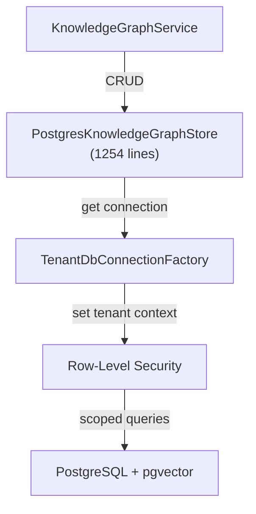

# SerialMemory.Infrastructure — Data Access & Integration

Parent: [00-root.md](./00-root.md)

## Purpose

PostgreSQL + pgvector data access layer, external service integrations, and operational infrastructure. The largest module at ~42k lines across 87 files. Implements all Core interfaces with concrete PostgreSQL, Redis, RabbitMQ, and Azure integrations. Multi-tenant via PostgreSQL Row-Level Security.

## Core Flow

## Sub-Components

### 1. PostgresKnowledgeGraphStore
**Files**: `PostgresKnowledgeGraphStore.cs` (1254 lines)
**Purpose**: Main data access — implements `IKnowledgeGraphStore` with Npgsql + Dapper for memories, entities, relationships, sessions, workspaces
**Key pattern**: All queries use parameterized SQL with pgvector `<=>` operator for cosine similarity

### 2. Auth & API Keys
**Files**: `Auth/`, `ApiKeyService.cs` (747 lines)
**Purpose**: API key management, JWT validation, RBAC, tenant authentication
**Key classes**: `ApiKeyService`, JWT middleware

### 3. Retrieval & Reasoning
**Files**: `Retrieval/HybridRetrievalEngine.cs` (706 lines), `Reasoning/DualPassReasoningEngine.cs` (832 lines), `Reasoning/ReasoningRunService.cs` (736 lines)
**Purpose**: Multi-axis hybrid retrieval (semantic + text + recency + confidence), dual-pass reasoning with critique/repair
**Key pattern**: Composite scoring with configurable weights

### 4. Memory Lifecycle
**Files**: `MemoryLayer/MemoryLayerWorker.cs` (956 lines), `MemoryLayer/LayerPromotionService.cs` (653 lines), `Classification/`, `Compilation/MemoryCompiler.cs` (872 lines)
**Purpose**: L0-L4 cognitive layer management, memory promotion/demotion, type classification, memory compilation (merging related memories)

### 5. Self-Healing & Integrity
**Files**: `SelfHealing/MemorySelfHealingEngine.cs` (752 lines), `SelfHealing/HealingRecommendationService.cs` (662 lines), `Integrity/`, `Privacy/IntegrityAuditService.cs`
**Purpose**: Autonomous contradiction detection, integrity verification, hash checking, healing recommendations

### 6. Billing & Quotas
**Files**: `Billing/UsageForecastingService.cs` (989 lines), `Billing/QuotaEnforcementService.cs` (703 lines)
**Purpose**: Usage tracking, forecasting, quota enforcement for SaaS mode

### 7. Operational Services
**Files**: `Services/EngineeringReasoningService.cs` (1170 lines), `KillSwitch/KillSwitchService.cs` (815 lines), `Crawlers/RelationshipCrawler.cs`, `ContextOptimization/ContextBudgetOptimizer.cs`, `Debugging/TimeTravelDebugger.cs` (691 lines)
**Purpose**: Engineering analysis, kill switch, relationship crawling, context budget management, time-travel debugging

## Gotchas & Tech Debt
- **PostgresKnowledgeGraphStore** at 1254 lines and **PostgresPowerUserService** at 1232 lines are both oversized — should be split
- Multiple files exceed 800-line threshold: `EngineeringReasoningService` (1170), `UsageForecastingService` (989), `MemoryLayerWorker` (956), `MemoryCompiler` (872), `DualPassReasoningEngine` (832)
- `DualPassReasoningEngine` uses `set_config('app.role', 'internal_admin', false)` to bypass RLS — security-sensitive pattern
- Connection factory creates new connections per operation rather than using connection pooling in some paths
- Shadow memory system (`PostgresShadowMemoryStore.cs`, 788 lines) adds significant complexity for branching/merging memories

## Database Patterns

- **Multi-tenancy**: PostgreSQL RLS with `app.tenant_id` and `app.workspace_id` session variables
- **Connection factory**: `TenantDbConnectionFactory` sets tenant context on each connection via `SET app.tenant_id`
- **Vector search**: pgvector `<=>` operator for cosine similarity on `vector(384)` or `vector(768)` columns
- **Hybrid search**: Combines pgvector similarity with PostgreSQL full-text search (`ts_vector`, `ts_query`)
- **Optimistic concurrency**: Version columns on key tables
