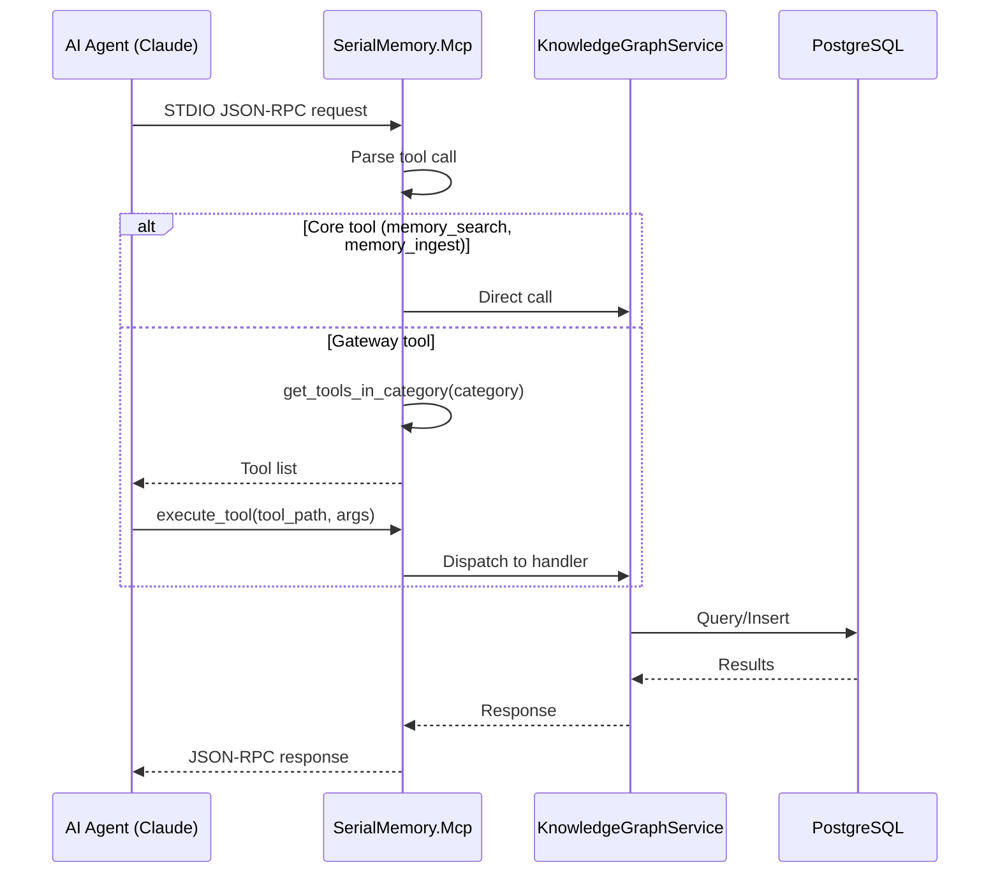

# SerialMemory.Mcp — MCP Protocol Server

Parent: [00-root.md](./00-root.md)

## Purpose

Model Context Protocol (MCP) server over STDIO for Claude and AI agent integration. Implements a two-tool gateway pattern (`get_tools_in_category` + `execute_tool`) for lazy tool discovery. The main entry point `Program.cs` (2203 lines) handles initialization, tool dispatch, and all MCP protocol messages.

## Core Flow

## Tool Taxonomy

```mermaid
graph TD
    Root["SerialMemory MCP Tools"]
    Core["Core (always listed)"]
    Gateway["Gateway (lazy discovery)"]

    Root --> Core
    Root --> Gateway

    Core --> search["memory_search"]
    Core --> ingest["memory_ingest"]
    Core --> about["memory_about_user"]
    Core --> multi["memory_multi_hop_search"]
    Core --> gettools["get_tools_in_category"]
    Core --> usetool["execute_tool"]

    Gateway --> lifecycle["lifecycle<br/>update, delete, merge, split,<br/>decay, reinforce, expire, supersede"]
    Gateway --> observe["observability<br/>trace, lineage, explain, conflicts"]
    Gateway --> safety["safety<br/>contradictions, hallucinations,<br/>integrity, scan_loops"]
    Gateway --> export["export<br/>workspace, memories, graph,<br/>user_profile, markdown"]
    Gateway --> reason["reasoning<br/>engineering_analyze,<br/>visualize, reason"]
    Gateway --> session["session<br/>init, end, instantiate_context"]
    Gateway --> admin["admin<br/>set_persona, integrations,<br/>import_core, crawl, stats,<br/>model_info, reembed"]
    Gateway --> workspace["workspace<br/>create, list, switch,<br/>snapshot_create/list/load"]
```

## Sub-Components

### 1. Program.cs (Entry Point)
**Files**: `Program.cs` (2203 lines)
**Purpose**: MCP server initialization, STDIO message loop, all tool handler implementations
**Key pattern**: Giant switch statement dispatching tool calls to handler methods

### 2. ToolGateway
**Files**: `Tools/ToolGateway.cs`
**Purpose**: Two-tool gateway — `get_tools_in_category` returns tool schemas, `execute_tool` dispatches by name
**Tools provided**: `get_tools_in_category`, `execute_tool`

### 3. ToolHierarchy
**Files**: `Tools/ToolHierarchy.cs`
**Purpose**: Lazy taxonomy organizing ~40 tools into 8 categories for progressive disclosure

### 4. ToolDefinitions (Shared)
**Files**: `SerialMemory.Mcp.Shared/ToolDefinitions.cs` (477 lines)
**Purpose**: JSON schema definitions for all core and admin tools — compact format (~100-150 tokens per tool)

### 5. Workspace & Snapshot Tools
**Files**: `Tools/WorkspaceTools.cs`, `Tools/SnapshotTools.cs`
**Purpose**: Workspace CRUD (create, list, switch) and state snapshots (create, list, load)

### 6. Specialized Tools
**Files**: `Tools/MemoryLifecycleTools.cs`, `MemoryObservabilityTools.cs`, `MemorySafetyTools.cs`, `MemoryExportTools.cs`, `SummarizationTools.cs`, `EngineeringReasoningTools.cs`, `AutoCaptureTools.cs`
**Purpose**: Domain-specific tool implementations grouped by category

## Gotchas & Tech Debt
- **Program.cs is 2203 lines** — a massive monolith that should be decomposed into handler classes
- Tool dispatch uses string matching rather than a registry pattern
- Core tools listed in `ToolDefinitions.cs` include lifecycle tools (update, delete, merge, split, reinforce, expire) that arguably belong in the gateway
- `threshold` default is cast as `(int)0.7` which truncates to `0` — likely a bug in `ToolDefinitions.cs:26`
- No request/response validation layer — raw JSON arguments passed directly to handlers
- STDIO protocol handling mixed with business logic in Program.cs
