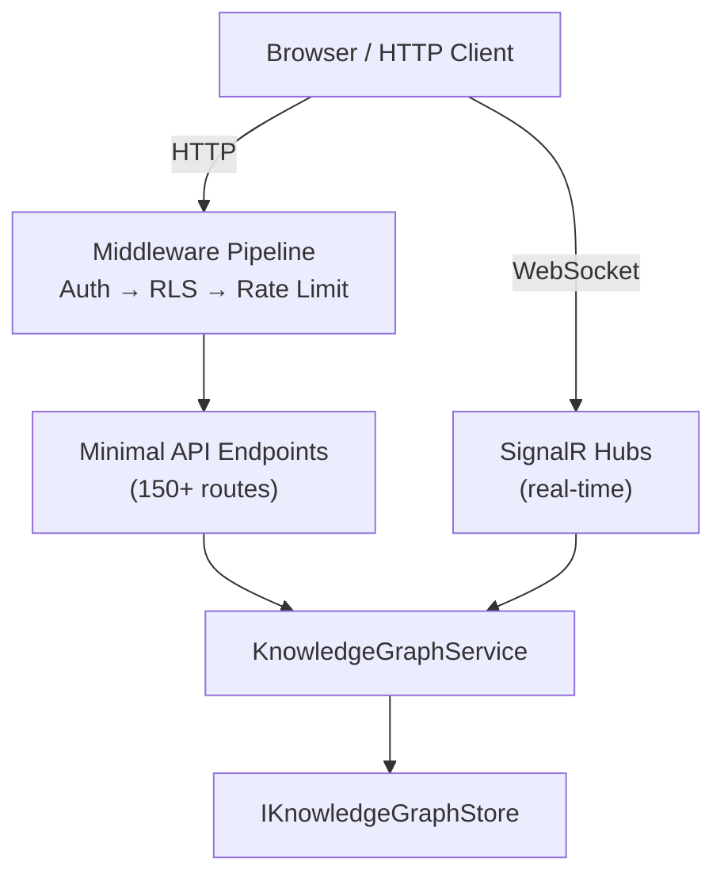

# SerialMemory.Api — REST API & Real-time

Parent: [00-root.md](./00-root.md)

## Purpose

ASP.NET Core 10 REST API server with 150+ minimal API endpoints, SignalR real-time hubs, and dashboard API. The main `Program.cs` is 5962 lines — the single largest file in the codebase. Serves as the HTTP presentation layer for the entire system.

## Core Flow

## Sub-Components

### 1. Memory & Search Endpoints
**Files**: `Program.cs` (lines 611-990)
**Purpose**: Memory CRUD, search, recent, multi-hop, context instantiation
**Endpoints**: `GET /api/memories/search`, `POST /api/memories`, `GET /api/memories/recent`, `GET /api/memories/multi-hop`, `GET /api/context/instantiate`

### 2. Graph & Entity Endpoints
**Files**: `Program.cs` (lines 991-1500)
**Purpose**: Knowledge graph visualization, entity browsing, relationship discovery, graph topology
**Endpoints**: `GET /api/graph`, `GET /api/graph/clustered`, `GET /api/entities`, `GET /api/relationships`, `POST /api/relationships/discover`

### 3. Mind Health & Reasoning
**Files**: `Program.cs` (lines 2185-2950)
**Purpose**: Mind health monitoring, reasoning traces, confidence drift, causal chains, dual-pass reasoning
**Endpoints**: `GET /api/mind/health`, `POST /api/reasoning/run`, `GET /api/memory/{id}/timeline`, `GET /api/confidence/trends`

### 4. Security & Integrity
**Files**: `Program.cs` (lines 3028-3530)
**Purpose**: Security scans, integrity verification, privacy audit, anomaly detection
**Endpoints**: `GET /api/security/integrity`, `POST /api/security/scan`, `GET /api/integrity/stats`, `POST /api/integrity/verify-all`

### 5. Power Mode & Mutations
**Files**: `Program.cs` (lines 3720-4200)
**Purpose**: Advanced memory editing, batch operations, conflict resolution, event replay, raw SQL
**Endpoints**: `GET /api/power/recent`, `PUT /api/power/memory/{id}/content`, `POST /api/power/sql`, `GET /api/mutations/pending`

### 6. Billing & Usage
**Files**: `Program.cs` (lines 1327-1940)
**Purpose**: Usage tracking, billing cycles, plan management, forecasting, shadow branches
**Endpoints**: `GET /api/usage/current`, `GET /api/billing/plan`, `POST /api/shadow/branches`

### 7. Health & Performance
**Files**: `Program.cs` (lines 565-610, 5480-5620)
**Purpose**: Health checks (live, ready, db, rls), performance metrics, latency tracking, cache stats
**Endpoints**: `GET /health/live`, `GET /api/performance/metrics`, `GET /api/performance/slow`

## Gotchas & Tech Debt
- **Program.cs is 5962 lines** — by far the biggest file, should be decomposed into endpoint groups using `MapGroup` or separate files
- All 150+ endpoints defined inline in a single file — no modular endpoint registration
- `POST /api/power/sql` endpoint allows **raw SQL execution** — extreme security risk, needs strict authorization
- Many endpoints lack request validation — raw parameters passed directly to services
- Shadow branch system (lines 1945-2180) adds ~250 lines of complexity for a feature that may not be widely used
- Self-healing endpoints (lines 5027-5120) trigger background operations but return immediately — no tracking of completion
- No OpenAPI/Swagger generation despite 150+ endpoints
- Health checks at lines 565-610 include RLS verification which queries the database on every health check
