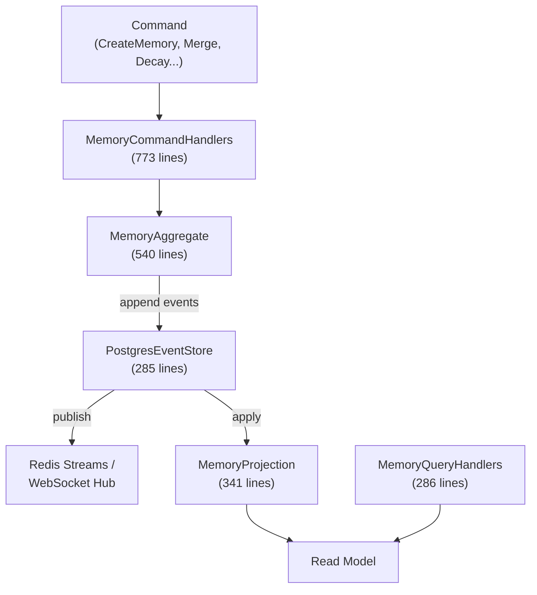
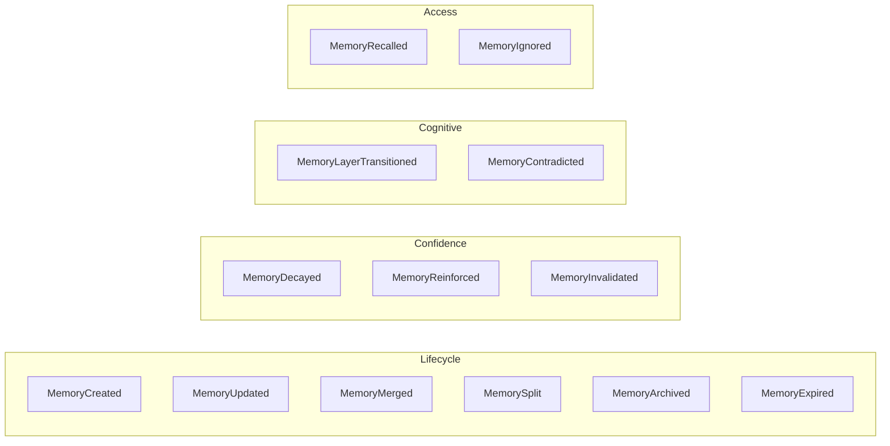

# SerialMemory.EventSourcing — Event Store & CQRS

Parent: [00-root.md](./00-root.md)

## Purpose

Fully event-sourced cognitive memory engine with append-only event store, CQRS command/query separation, multi-axis retrieval, autonomous maintenance workers, and real-time streaming via Redis Streams and WebSocket. 6670 lines across 28 well-structured files.

## Core Flow

## Event Types

## Sub-Components

### 1. Events
**Files**: `Events/MemoryEvents.cs` (312 lines), `MemoryEventType.cs`, `IMemoryEvent.cs`, `CognitiveStage.cs`, `SafetyEvents.cs`
**Purpose**: 13 event type definitions with payloads, cognitive stage tracking (Perception → Understanding → Reasoning → Action → Reflection)

### 2. CQRS Commands & Handlers
**Files**: `CQRS/Commands.cs` (205 lines), `CQRS/MemoryCommandHandlers.cs` (773 lines)
**Purpose**: Write-side — 12 command types (Create, Update, Reinforce, Merge, Split, Decay, Archive, Expire, Recall, Invalidate, Contradict, LayerTransition)

### 3. CQRS Queries & Handlers
**Files**: `CQRS/Queries.cs` (133 lines), `CQRS/MemoryQueryHandlers.cs` (286 lines)
**Purpose**: Read-side — SearchMemories, GetById, GetRelated, FindDuplicates, GetLayerStatistics, GetRecent, GetCognitiveStageLog

### 4. Event Store
**Files**: `Store/PostgresEventStore.cs` (285 lines), `Store/IEventStore.cs` (101 lines), `Store/EventWriter.cs` (375 lines)
**Purpose**: Append-only PostgreSQL event store with global sequence, optimistic concurrency, stream subscription

### 5. Retrieval Engine
**Files**: `Retrieval/CompositeRetrievalEngine.cs` (423 lines), `Retrieval/RetrievalScore.cs` (142 lines)
**Purpose**: Multi-axis scoring: semantic (0.35) + recency (0.15) + confidence (0.20) + user affinity (0.15) + directive match (0.15) - contradiction penalty (0.10)

### 6. Streaming
**Files**: `Streaming/RedisEventStreamPublisher.cs` (224 lines), `Streaming/WebSocketEventHub.cs` (362 lines), `Streaming/EventBroadcastService.cs` (117 lines)
**Purpose**: Durable event delivery via Redis Streams with consumer groups, real-time WebSocket broadcasting with subscription filtering

### 7. Maintenance & Export
**Files**: `Maintenance/MaintenanceWorkers.cs` (539 lines), `Export/MemoryExporter.cs` (513 lines)
**Purpose**: Autonomous background workers for decay, archival, reinforcement, dedup, contradiction detection. Full/chunked/encrypted JSON export with GZip compression

## Memory Layers

| Layer | Description | Promotion Trigger |
|-------|-------------|-------------------|
| `L0_RAW` | Raw transcript or input | Initial ingestion |
| `L1_CONTEXT` | Contextual understanding | Entity extraction complete |
| `L2_SUMMARY` | Summarized information | Multiple related L1 memories |
| `L3_KNOWLEDGE` | Extracted facts | Validated, high-confidence L2 |
| `L4_HEURISTIC` | Learned patterns | Cross-cutting L3 knowledge |

## Gotchas & Tech Debt
- `MemoryCommandHandlers.cs` at 773 lines handles all 12 commands — should be split into individual handler files
- `MemoryAggregate.cs` at 540 lines manages all state transitions — growing complexity
- Confidence decay formula (`confidence * 0.5^(days/halfLife)`) can produce very small floating-point values — no minimum threshold
- `MemoryLayer` enum defined separately from Core's version — duplication risk
- Redis Streams consumer groups (`projections`, `maintenance`) are auto-created but not cleaned up
- `EventWriter` writes to both `memory_events` and `event_log` tables — dual-write without transactional guarantee
- WebSocket hub uses in-memory subscription tracking — lost on restart
