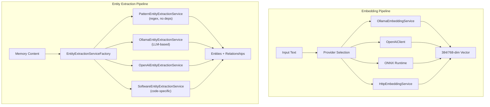

# SerialMemory.ML — AI/ML Services

Parent: [00-root.md](./00-root.md)

## Purpose

Machine learning services for embedding generation and named entity recognition (NER). Supports multiple providers (Ollama, OpenAI, ONNX, HTTP) with a factory pattern for provider selection. ~2100 lines across 10 files — the smallest but most critical module since embeddings power all semantic search.

## Core Flow

## Sub-Components

### 1. OllamaEmbeddingService
**Files**: `OllamaEmbeddingService.cs`
**Purpose**: Local embedding generation via Ollama API (default: nomic-embed-text, 768-dim)
**Provider**: Ollama (local or cloud via `OLLAMA_CLOUD_API_KEY`)

### 2. HttpEmbeddingService
**Files**: `HttpEmbeddingService.cs`
**Purpose**: HTTP client for remote embedding service (FastAPI/Python), supports batch embedding
**Provider**: Custom HTTP endpoint at `EMBEDDING_SERVICE_URL`

### 3. OpenAiClient
**Files**: `OpenAiClient.cs`
**Purpose**: OpenAI API client for both embeddings and LLM completions
**Provider**: OpenAI API

### 4. PatternEntityExtractionService
**Files**: `PatternEntityExtractionService.cs`
**Purpose**: Regex-based NER — zero external dependencies, extracts PERSON, ORG, EMAIL, URL, DATE, etc.
**Key feature**: Works offline, no API calls needed

### 5. SoftwareEntityExtractionService
**Files**: `SoftwareEntityExtractionService.cs`
**Purpose**: Domain-specific extraction for code entities — SOFTWARE, API, DATABASE, FRAMEWORK, LIBRARY, etc.
**Key feature**: Recognizes code patterns like class names, file paths, package names

### 6. LLM-based Entity Extraction
**Files**: `OllamaEntityExtractionService.cs`, `OpenAiEntityExtractionService.cs`, `HttpEntityExtractionService.cs`
**Purpose**: LLM-powered extraction for higher-quality NER using Ollama or OpenAI
**Key tradeoff**: Better accuracy but slower and requires API access

### 7. EntityExtractionServiceFactory
**Files**: `EntityExtractionServiceFactory.cs`
**Purpose**: Provider selection logic — chooses extraction service based on configuration and availability
**Pattern**: Factory pattern with fallback chain

## Supported Embedding Models

| Model | Dimensions | Pooling | Quality |
|-------|-----------|---------|---------|
| all-MiniLM-L6-v2 | 384 | mean | Good (default legacy) |
| nomic-embed-text | 768 | mean | Better (Ollama default) |
| all-mpnet-base-v2 | 768 | mean | Best in class |
| bge-small-en-v1.5 | 384 | cls | Good for retrieval |
| e5-large-v2 | 1024 | mean | Top-tier |

## Gotchas & Tech Debt
- ONNX model path configuration requires manual model export (`optimum-cli export onnx`) — not automated
- Switching embedding models requires database migration (`ops/migrate_embedding_dimension.sql`) and full re-embedding
- `HttpEmbeddingService` has no retry/circuit-breaker logic — if the Python service is down, all ingestion fails
- Pattern extraction is fast but misses context-dependent entities — "Apple" won't be tagged as ORG without surrounding context
- No embedding cache — the same text re-embedded on every ingest (e.g., duplicate detection queries)
- OpenAI client doesn't implement rate limiting or token budget tracking
- Factory selection logic isn't configurable at runtime — requires restart to switch providers
