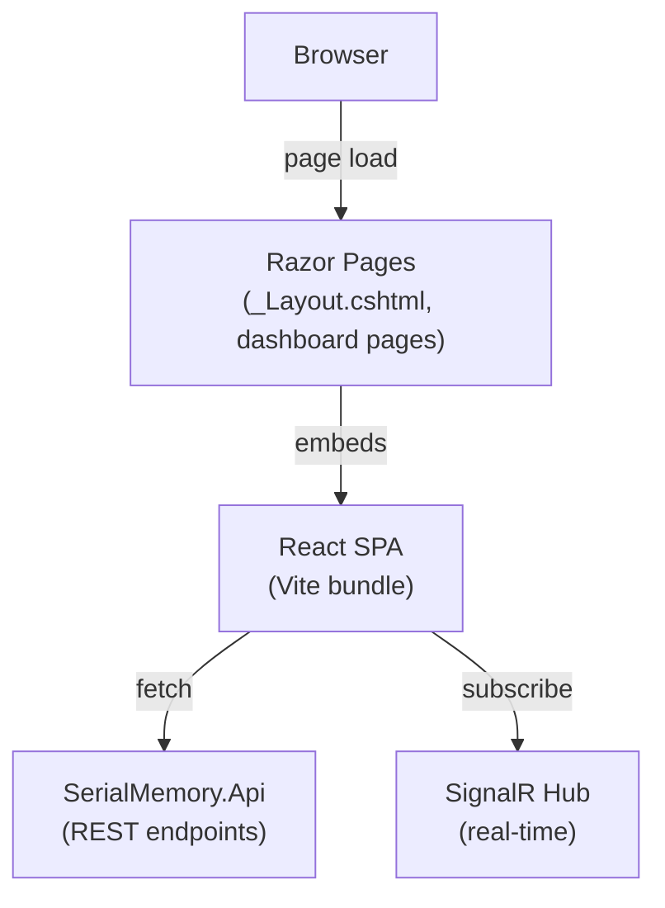
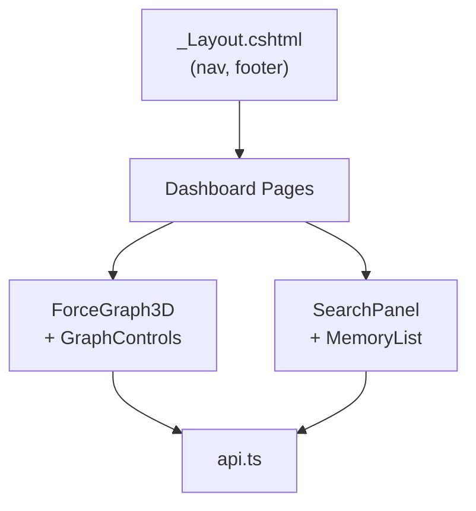

# SerialMemory.Web — Dashboard & Admin UI

Parent: [00-root.md](./00-root.md)

## Purpose

Hybrid Razor Pages + React SPA dashboard for SerialMemory administration. Razor Pages handle server-side routing, auth, and layout. React (Vite) powers the interactive 3D knowledge graph, memory search, and real-time visualizations. ~7400 lines across 40 files. Includes JWT-based internal token middleware for SaaS vs self-hosted modes.

## Core Flow

## Sub-Components

### 1. Razor Pages & Layout
**Files**: `Pages/Shared/_Layout.cshtml` (178 lines), `Pages/*.cshtml`
**Purpose**: Server-side HTML shell with navigation, auth-aware menus, role-based route protection
**Key feature**: Self-hosted mode banner, root admin restricted routes (Power Mode, Control Room, Performance)

### 2. 3D Knowledge Graph
**Files**: `src/components/Graph/ForceGraph3D.tsx` (263 lines), `GraphControls.tsx` (148 lines)
**Purpose**: Three.js force-directed 3D graph with bloom post-processing, fog, emissive glow nodes, and entity-type clustering
**Key libs**: react-force-graph-3d, THREE.js, UnrealBloomPass

### 3. Search & Memory List
**Files**: `src/components/Sidebar/SearchPanel.tsx` (70 lines), `MemoryList.tsx` (114 lines)
**Purpose**: Semantic/text/hybrid search with mode selection, memory results with entity badges, similarity scores, relative timestamps

### 4. API Client
**Files**: `src/lib/api.ts` (115 lines)
**Purpose**: Typed fetch wrappers for graph, search, stats, ingest, and RAG endpoints
**Key functions**: `fetchGraphData()`, `searchMemories()`, `ingestMemory()`, `askMyMemory()`

### 5. Types & Theme
**Files**: `src/types/graph.ts` (131 lines), `src/types/rag.ts`
**Purpose**: TypeScript types for GraphNode, GraphEdge, Memory, Entity, ForceGraphNode/Link. Color palettes for nodes, links, entity types (SerialMemory theme: midnight, navy, electric, cyan)

### 6. Auth & Token Middleware
**Files**: `Services/InternalTokenMiddleware.cs` (175 lines), `Services/InternalTokenService.cs`
**Purpose**: Auto-generates internal JWT tokens for authenticated users, refreshes before expiration, enforces route-level access control in SaaS mode
**Key pattern**: Session-stored tokens with tenant/user mismatch detection

### 7. Dashboard Pages
**Files**: `Pages/Dashboard/*.cshtml` (Memories, Graph, Conflicts, Traces, Mutations, Mind, Power, Performance, Privacy, Timeline, Shadow, Reasoning, Visualize, Exports, Security, etc.)
**Purpose**: 20+ dashboard pages — each embeds React components or uses vanilla JS for data visualization
**Key pages**: Memory browser, knowledge graph, conflict resolution, mind health, power mode, reasoning traces

## Component Hierarchy

## Gotchas & Tech Debt
- **Hybrid architecture** (Razor + React) means two rendering pipelines — harder to maintain and test
- Tailwind CSS loaded from CDN (`cdn.jsdelivr.net`) rather than locally bundled — no tree shaking, performance concern
- `InternalTokenMiddleware` uses `Session.GetString()` for token storage — requires sticky sessions in multi-instance deployments
- Dashboard has 20+ pages but no shared state management — each page independently fetches data
- 3D graph WebGL requires `'unsafe-eval'` CSP for Three.js — security tradeoff
- RAG API functions in `api.ts` point to `/rag/` endpoints that may not be deployed in all configurations
- No client-side routing — each dashboard page is a full page reload via Razor
- The "More" dropdown menu uses inline JavaScript rather than a React component
